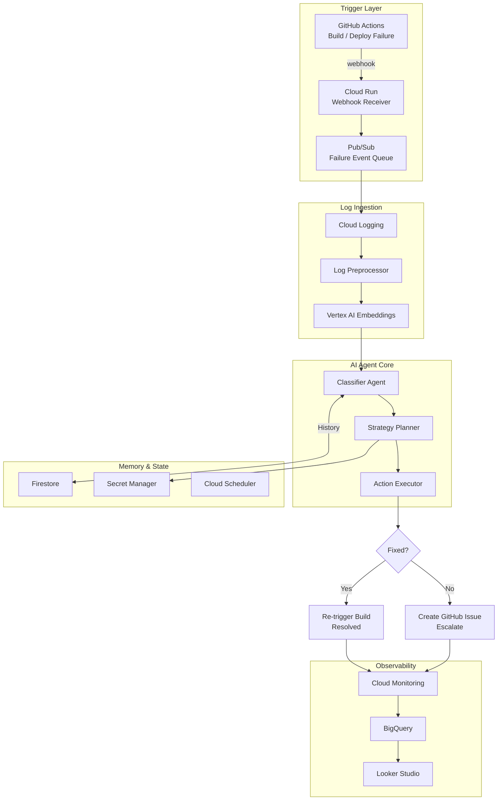

# AI-Powered CI/CD Failure Recovery Agent

## Overview

This repository contains the Solution Architecture and implementation artifacts for an **AI-powered autonomous failure recovery agent** designed to detect, diagnose, and remediate CI/CD pipeline failures.

The system integrates event-driven cloud services, agentic AI reasoning, historical memory, and observability tooling to:

- Detect build/deployment failures automatically
- Analyze logs using AI
- Classify root causes
- Trigger automated remediation where possible
- Escalate unresolved failures with recommendations
- Learn from previous incidents for continuous improvement

---

# Solution Architecture

## High-Level Architecture Diagram (Mermaid)



---

# Problem Statement

CI/CD failures often result in:

- Delayed deployments
- Increased engineering effort
- Repeated failure patterns
- Slow root-cause diagnosis
- Poor visibility into failure trends

Traditional pipelines stop at failure notification.

This solution extends pipelines with **autonomous recovery intelligence**.

---

# Objectives

The platform aims to:

- Reduce MTTR (Mean Time To Recovery)
- Automate common remediation actions
- Improve deployment reliability
- Build organizational knowledge from failure history
- Provide intelligent escalation for unresolved incidents

---

# Architecture Components

## 1. Trigger Layer

Detects and captures pipeline failures.

### Components

### GitHub Actions
Generates events when:

- Build fails
- Tests fail
- Deployment fails

### Cloud Run Webhook Receiver
Receives webhook events and normalizes them.

Responsibilities:

- Validate incoming events
- Extract metadata
- Forward failure events

### Pub/Sub
Decouples event ingestion.

Benefits:

- Asynchronous processing
- Scalability
- Reliability
- Retry support

---

## 2. Log Ingestion Layer

Processes failure evidence.

### Cloud Logging
Stores:

- Build logs
- Deployment logs
- Error traces
- Runtime failures

### Log Preprocessor
Performs:

- Log cleaning
- Chunking
- Deduplication
- Context extraction

### Vertex AI Embeddings
Transforms logs into semantic vectors for:

- Similarity search
- Failure pattern matching
- Contextual reasoning

---

## 3. AI Agent Core

Core autonomous reasoning engine.

## Classifier Agent
Classifies failure categories:

- Flaky tests
- Dependency failures
- Configuration issues
- Infrastructure problems
- Unknown anomalies

---

## Strategy Planner
Determines response strategy:

Examples:

- Retry pipeline
- Patch variables
- Roll back deployment
- Escalate to engineers

Decision factors:

- Confidence score
- Historical patterns
- Risk profile

---

## Action Executor
Executes remediation actions.

Possible actions:

- Re-trigger builds
- Update pipeline parameters
- Trigger rollback
- Open incident ticket

---

# 4. Memory and State

## Firestore
Stores:

- Failure patterns
- Resolution history
- Learned remediation strategies

Provides agent memory.

---

## Secret Manager
Stores:

- GitHub tokens
- API credentials
- Automation secrets

Security boundary for privileged actions.

---

## Cloud Scheduler
Runs scheduled tasks:

- Trend analysis
- Pattern mining
- Knowledge refresh

---

# 5. Outcome Management

## Successful Recovery Path
If auto-remediation succeeds:

- Build retriggered
- Deployment recovered
- Team notified
- Metrics updated

---

## Escalation Path
If unresolved:

Generate GitHub issue containing:

- Failure category
- Root cause analysis
- Suggested fixes
- Relevant log excerpts

---

# 6. Observability Layer

## Cloud Monitoring
Tracks:

- Recovery success rate
- Agent latency
- Failure frequency
- MTTR improvements

---

## BigQuery
Stores analytical failure data.

Used for:

- Trend analysis
- Reporting
- Reliability insights

---

## Looker Studio
Dashboards for:

- Recovery metrics
- Failure trends
- Agent effectiveness

---

# Technology Stack

| Layer | Technology |
|------|------------|
| CI/CD | GitHub Actions |
| Eventing | Pub/Sub |
| Compute | Cloud Run |
| Logging | Cloud Logging |
| AI | Gemini / Vertex AI |
| Embeddings | Vertex AI Embeddings |
| Memory | Firestore |
| Secrets | Secret Manager |
| Analytics | BigQuery |
| Monitoring | Cloud Monitoring |
| Dashboards | Looker Studio |

---

# Key Architectural Patterns

## Event-Driven Architecture
Uses asynchronous events for decoupling.

Benefits:

- Scalable
- Resilient
- Reactive

---

## Agentic AI Pattern
Implements:

- Reasoning
- Planning
- Action execution

Agent loop:

Observe → Analyze → Decide → Act

---

## Retrieval-Augmented Reasoning
Combines:

- Historical failure memory
- Semantic retrieval
- LLM reasoning

Improves diagnosis quality.

---

## Self-Healing Architecture
Supports autonomous recovery.

Examples:

- Automatic retries
- Configuration repair
- Intelligent escalation

---

# Security Considerations

## Security Controls

Implemented controls:

- IAM least privilege
- Secret isolation
- Audit logging
- Token rotation
- Encrypted storage

---

## Recommended Enhancements

- VPC Service Controls
- Policy validation gates
- Human approval for risky actions
- Role-based remediation permissions

---

# Scalability Considerations

Designed for scale using:

- Serverless Cloud Run autoscaling
- Pub/Sub event buffering
- Stateless AI agents
- Horizontal workload distribution

Supports large CI/CD event volumes.

---

# Reliability Features

Includes:

- Retry logic
- Dead-letter queues
- Failure isolation
- Escalation fallback
- Monitoring alerts

---

# Example Failure Flow

## Scenario
Deployment fails due to missing dependency.

Flow:

1. GitHub Actions emits failure
2. Cloud Run receives webhook
3. Event enters Pub/Sub
4. Logs collected and embedded
5. Agent classifies dependency failure
6. Strategy planner selects patch + retry
7. Pipeline reruns
8. Success metrics updated

If retry fails:

9. GitHub issue created
10. Incident escalated

---

# Repository Structure

```bash
.
├── docs/
│   ├── architecture/
│   ├── diagrams/
│   └── proposal/
│
├── agent/
│   ├── classifier/
│   ├── planner/
│   └── executor/
│
├── infrastructure/
│   ├── terraform/
│   └── deployment/
│
├── monitoring/
│   └── dashboards/
│
└── README.md
```

---

# Future Enhancements

Potential roadmap:

- Multi-agent collaboration
- Predictive failure prevention
- Autonomous pipeline optimization
- Root-cause graph reasoning
- LLM-powered incident copilots

---

# Benefits

Expected outcomes:

- Faster incident recovery
- Reduced manual intervention
- Improved deployment reliability
- Lower operational overhead
- Continuous learning system

---

# Risks and Mitigations

| Risk | Mitigation |
|------|------------|
| Wrong remediation action | Human approval for high-risk actions |
| False classifications | Confidence thresholds + escalation |
| AI hallucinations | Grounding using logs + memory |
| Secret misuse | Secret Manager + IAM controls |
| Scaling bottlenecks | Event-driven architecture |

---

# Architecture Assumptions

Assumes:

- GitHub-based CI/CD
- GCP deployment environment
- Gemini / Vertex AI availability
- Access to build/deployment logs
- Enterprise monitoring stack

---

# Getting Started

## Clone repository

```bash
git clone https://github.com/your-org/ai-failure-recovery-agent.git
cd ai-failure-recovery-agent
```

---

## View Mermaid diagrams

Use:

- GitHub Mermaid rendering
- Eraser.io
- Mermaid Live Editor
- VS Code Mermaid Preview

---

# Generate Updated Diagram in Eraser

Paste the Mermaid block into Eraser and refine:

Suggested improvements:

- Add trust boundaries
- Add security zones
- Add GCP service icons
- Split workflow vs deployment diagrams

---

# Authors

Solution Architecture Team

Contributors:

- Architecture Design
- AI Agent Engineering
- DevOps Automation
- Observability Engineering

---

# License

MIT License

---

## Summary

This project demonstrates an intelligent self-healing CI/CD architecture that combines:

- Event-driven cloud services
- Agentic AI reasoning
- Memory-driven remediation
- Autonomous recovery
- Enterprise observability

Moving from reactive DevOps toward autonomous reliability engineering.

